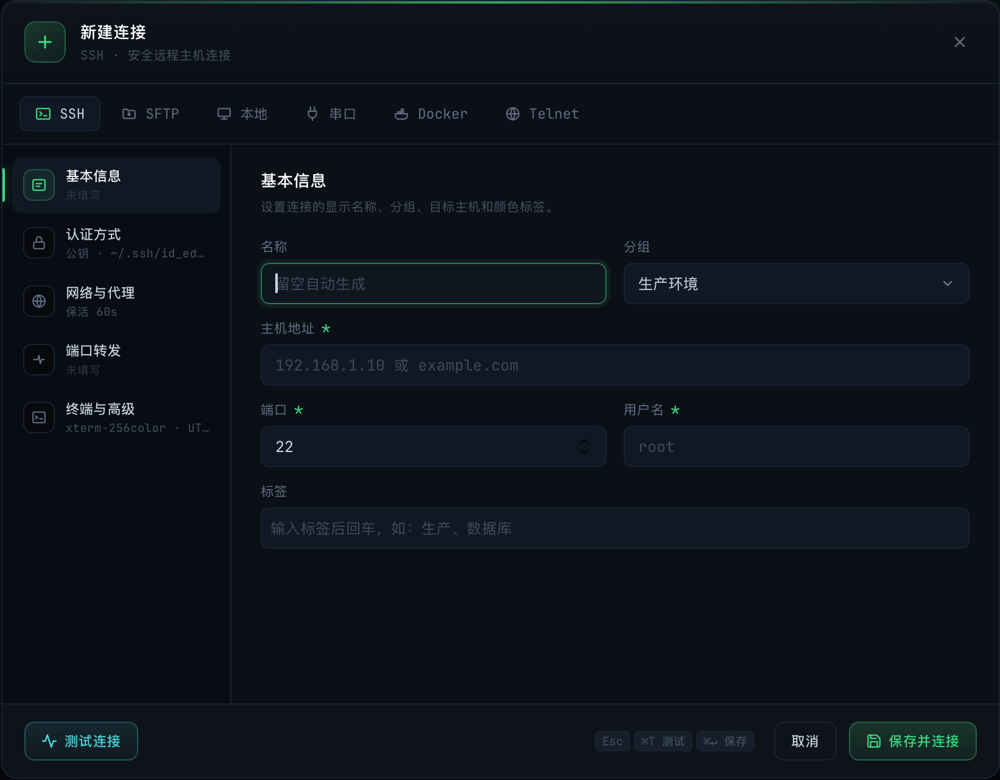
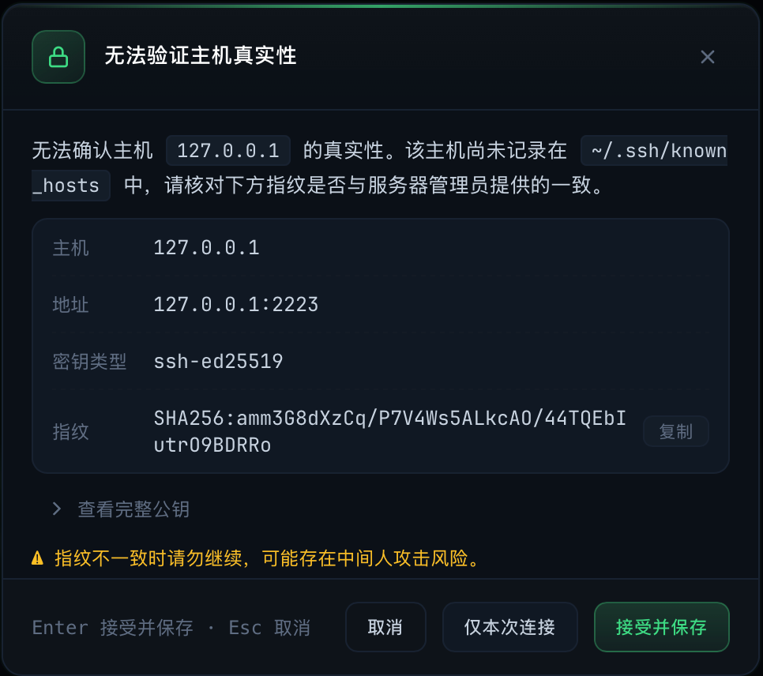
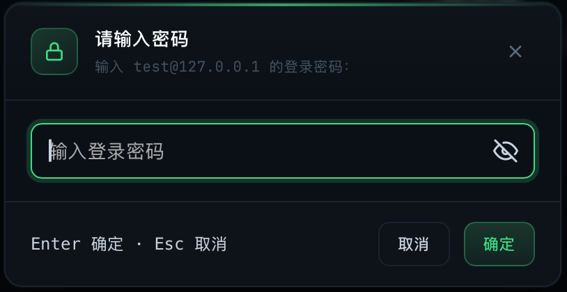

# 快速开始

> description: 下载安装 Rhost，新建 SSH 连接并完成首次主机密钥确认，进入工作台
>
> created: 2026-10-09 11:06:27
>
> updated: 2026-10-09 11:06:27
>
> author: [sjzhao](https://github.com/ShiJieCloud/rhost)

## 1. Rhost 能做什么

Rhost 是一款跨平台远程主机管理器，把以下能力整合在一个桌面应用里：

- **多标签 SSH 终端**：同时连接多台主机，会话独立隔离；
- **SFTP 文件管理**：双栏浏览本地与远程目录，拖拽传输、断点续传；
- **服务器监控**：实时查看 CPU、内存、磁盘、网络、进程指标；
- **端口转发**：本地 / 远程 / SOCKS5 动态代理隧道。


*工作台全景：多标签终端、SFTP、服务器监控*

读完本指南，你可以装好 Rhost、连上第一台主机并进入工作台。各功能的详细使用见后续使用指南；想从源码构建或参与开发，见 [开发指南](../guides/development.md)。

## 2. 下载与安装

> 各平台详细安装步骤、系统要求与权限说明见 [安装指南](../guides/install.md)。

本节只给最简路径，让你尽快跑通。

### 2.1 获取安装包

前往 [Releases 页面](https://github.com/ShiJieCloud/rhost/releases)，按你的系统选择对应安装包：

| 系统 | 安装包 | 说明 |
|---|---|---|
| macOS（Apple Silicon） | `*_aarch64.dmg` | M 系列芯片 |
| macOS（Intel） | `*_x64.dmg` | Intel 芯片 |
| Windows | `*_x64-setup.exe` 或 `*_x64.msi` | Windows 10/11 |
| Linux | `*.deb` / `*.rpm` / `*.AppImage` | 按发行版选择 |

### 2.2 安装注意事项

- **macOS**：从浏览器下载的 `.dmg` 装好后若提示「"rhost" 已损坏，无法打开」，运行以下命令移除隔离属性后再打开（右键 → 打开对此错误无效）：

  ```bash
  xattr -dr com.apple.quarantine /Applications/rhost.app
  ```

- **Windows**：首次运行可能有 SmartScreen 提示，点「更多信息」→「仍要运行」；
- **Linux**：`AppImage` 需先加执行权限：

  ```bash
  chmod +x rhost-*.AppImage
  ./rhost-*.AppImage
  ```

## 3. 首次 SSH 连接

### 3.1 准备远程主机

你需要一台可通过 SSH 登录的远程主机，并准备好：

- 主机地址（IP 或域名）与端口（默认 22）；
- 登录用户名；
- 认证方式：**密码**，或**私钥文件**（如 `~/.ssh/id_ed25519`）。

常见来源：云服务器（阿里云 / 腾讯云 / AWS 等）、家庭 NAS、路由器、树莓派等。

### 3.2 新建 SSH 连接

启动 Rhost，进入首页。有两种方式新建连接。

#### 3.2.1 方式一：快速连接（最快）

在首页「快速连接」输入框直接输入 SSH 命令，按 `Enter` 立即连接：

```text
ssh root@10.0.1.25 -p 22
```

也可指定私钥：

```text
ssh -i ~/.ssh/id_ed25519 ubuntu@192.168.1.50 -p 22
```

输入框下方有历史命令与示例模板，`↑` `↓` 可切换历史，`Esc` 清空。


*首页快速连接输入框*

#### 3.2.2 方式二：新建连接（保存到主机列表）

点击左上角「新建」按钮，在弹出的「新建连接」窗口填写：

1. **基本信息**：主机地址、端口、用户名；
2. **认证方式**：选「密码」输入密码，或选「公钥」并选择私钥文件（私钥有口令时下一步会提示）；
3. （可选）**端口转发**：配置隧道规则；
4. 点「保存」。


*新建连接：基本信息 + 认证方式 + 端口转发*

保存后主机出现在左侧主机列表，双击即可连接。密码与私钥口令会存入系统钥匙串（macOS 钥匙串 / Windows 凭据管理 / Linux libsecret），**不写入配置文件**。

### 3.3 主机密钥确认

首次连接某台主机时，Rhost 会弹出**主机密钥确认**窗口：

- 显示服务器指纹与完整公钥；
- 两个选择：
  - **接受并保存**：信任该主机，指纹写入本地 `known_hosts`，后续连接不再提示；
  - **仅本次连接**：本次会话可用，但不落盘，下次新建连接仍会提示。


*首次连接的主机密钥确认弹窗，可展开查看完整公钥*

> 若同一主机指纹发生变化（服务器重装 / IP 复用），会弹出**红色警告**。确认是合法变更（如服务器重装系统）才点「更新指纹并重连」；否则可能是中间人攻击，应点「断开」并排查。

密码认证时，若密码未在新建连接时填写，会弹密码框输入；输入后可选择是否保存到钥匙串。


*密码认证弹窗，密码存入系统钥匙串*

连接成功后即进入工作台，可使用多标签终端、SFTP 文件管理、服务器监控与端口转发。

## 4. 连接成功后的操作


*连接成功后的工作台：标签栏、终端区域与底部 Dock*

连接成功后进入工作台，可使用以下核心功能：

### 4.1 多标签终端

- 双击主机列表中的任意主机即可在新标签打开终端；
- 标签右键菜单支持重命名、复制会话、断开、关闭等操作；
- 多个会话可同时使用「广播」功能向所有终端发送同一命令。

详见 [SSH 终端](../guides/ssh-terminal.md)。

### 4.2 SFTP 文件管理

- 终端标签右键 →「打开 SFTP」或工作台底部 Dock 切换到 SFTP 面板；
- 左侧本地文件、右侧远端文件，支持拖拽上传下载；
- 传输队列展示进度，支持暂停、取消、断点续传。

详见 [SFTP 文件传输](../guides/sftp.md)。

### 4.3 服务器监控

- 工作台底部 Dock 切换到监控面板；
- 实时展示 CPU、内存、磁盘、网络流量；
- 数据采集间隔与告警阈值可在全局设置中调整。

### 4.4 端口转发

- 连接表单的「端口转发」分区可预配置规则，连接后自动生效；
- 工作台「端口转发」标签可查看规则状态、流量统计，支持动态增删；
- 支持本地转发（-L）、远程转发（-R）、动态 SOCKS5 转发（-D）。

详见 [SSH 端口转发设计](../explanation/design/tunnel-design.md)。

## 5. 下一步

- [安装指南](../guides/install.md)：各平台安装与权限说明；
- [主机与密钥管理](../guides/host-management.md)：主机列表、分组、连接配置与密钥管理；
- [全局设置](../reference/global-settings.md)：终端外观、SFTP 传输、端口转发等配置项；
- [常见问题](../faq/index.md)：使用过程中的常见疑问。
