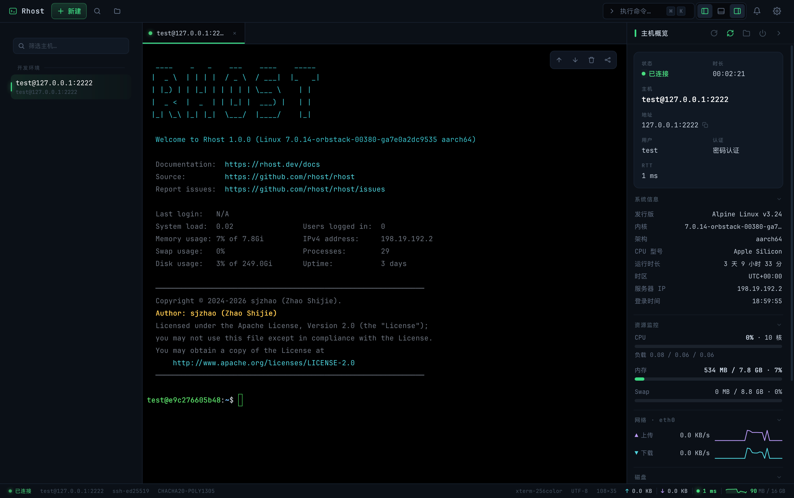
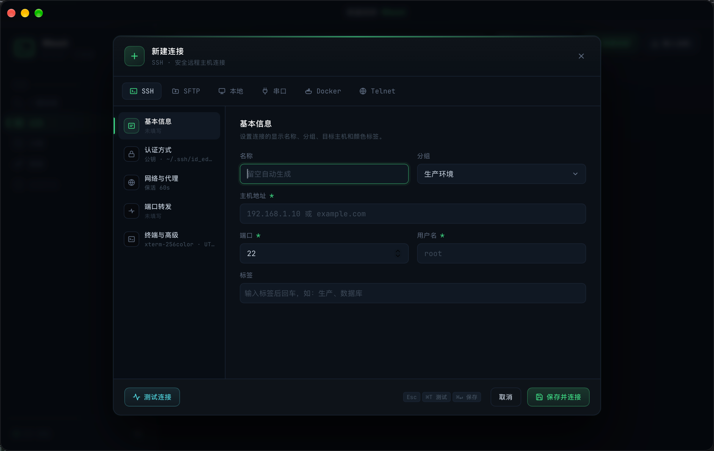
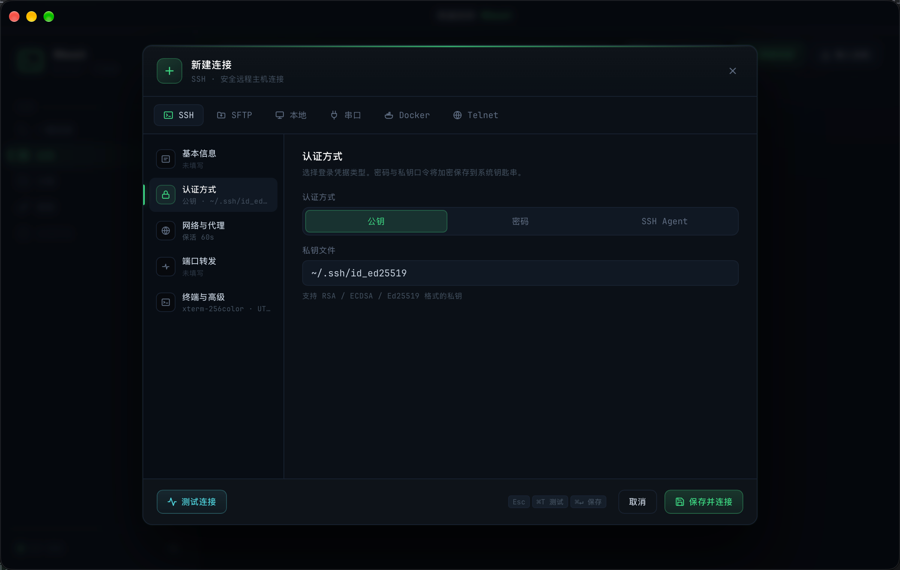
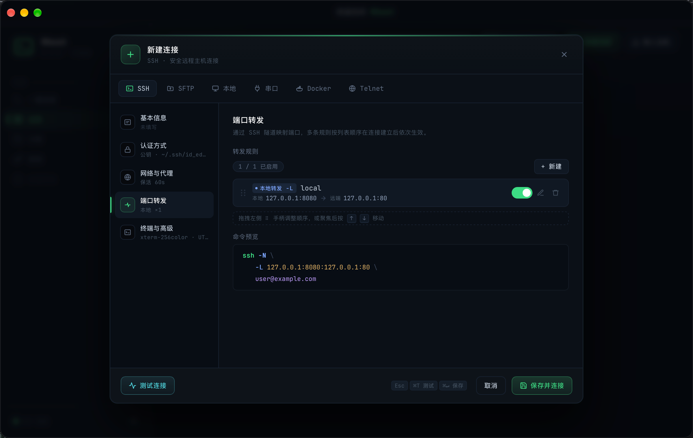
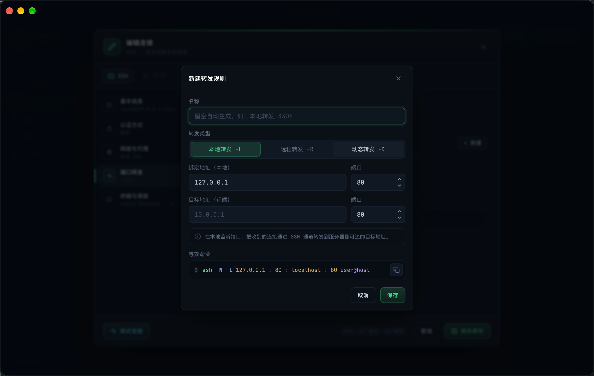
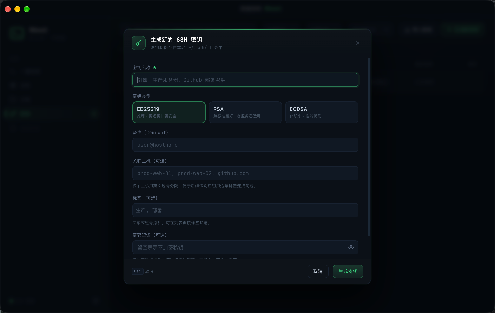

# 主机与密钥管理

> description: 主机列表与状态、分组管理、新建/编辑连接表单、密钥管理与配置导入导出
>
> created: 2026-10-09 15:52:00
>
> updated: 2026-10-09 15:52:00
>
> author: [sjzhao](https://github.com/ShiJieCloud/rhost)

## 1. 主机列表

首页主机列表展示所有已保存的主机，每条主机卡片显示名称、地址、端口与分组。

### 1.1 连接

双击主机卡片即发起连接；连接前会校验配置，通过后打开工作台会话。主机卡片不展示连接状态标识，连接情况由工作台会话状态体现。

### 1.2 搜索

列表顶部搜索框可按主机名或地址过滤；分组视图下也可搜索分组名。列表上方显示分组数量与覆盖主机数统计。

## 2. 分组管理

主机按分组组织，便于分类管理（如「生产」「测试」「内网」）。

| 操作 | 说明 |
|---|---|
| 新建分组 | 在分组列表新建，输入名称 |
| 重命名分组 | 修改分组名称 |
| 删除分组 | 二次确认后删除；**非兜底分组**才可删，删除后组内主机移入兜底分组（fallback） |

> 存在一个不可删除的兜底分组，未指定分组的主机都归于此。删除某分组不会删除组内主机，而是把它们移入兜底分组。

主机可在分组间移动（编辑主机时选择目标分组，或拖拽到目标分组）。

## 3. 新建 / 编辑连接

点击「新建」打开连接表单，编辑已有主机时打开同一表单。表单分为五个分区：

| 分区 | 关键内容 |
|---|---|
| 基本信息 | 主机名称、地址、端口、用户名、分组、备注 |
| 认证方式 | 密码 / 公钥 / SSH Agent 三选一 |
| 网络与代理 | 连接超时、保活间隔、代理配置 |
| 端口转发 | 本地 `-L` / 远程 `-R` / 动态 `-D` 规则，连接时自动建立 |
| 终端与高级 | 终端参数（字体、编码等）、高级选项 |

### 3.1 认证方式

| 方式 | 需填 | 说明 |
|---|---|---|
| 密码 | 密码 | 存入系统钥匙串，不写入配置文件 |
| 公钥 | 私钥文件路径（私钥有口令则另填） | 私钥只记录本地路径，不上传 |
| SSH Agent | 无需额外凭据 | 复用系统 ssh-agent 已加载的密钥 |

> 密码与私钥口令均存入系统钥匙串（macOS Keychain / Windows 凭据管理 / Linux libsecret），首次使用时系统可能弹授权。

### 3.2 端口转发

在「端口转发」分区可预配置规则，连接建立后自动生效，也可在工作台「端口转发」标签查看与调整。规则设计见 [SSH 端口转发](../explanation/design/tunnel-design.md)。

## 4. 密钥管理

密钥管理页集中维护用于公钥认证的私钥文件。

### 4.1 列表与检索

每条密钥展示名称、指纹、类型、标签与关联主机数。支持：

| 检索维度 | 操作 |
|---|---|
| 搜索 | 按名称、指纹、标签、关联主机名搜索 |
| 过滤 | 按类型、标签过滤 |
| 排序 | 按创建时间、最后使用、关联主机数、名称排序 |

### 4.2 密钥操作

- **新增**：选择本地私钥文件，可设名称与标签；
- **删除**：移除密钥记录（不删除本地文件）；
- **关联主机**：主机在「公钥」认证方式中选择某密钥即建立关联。

私钥文件本身只记录本地路径，**绝不上传**任何第三方；口令存系统钥匙串。

## 5. 配置导入导出

支持整体配置导入导出与主机批量导入，便于在多台设备间迁移或备份。

| 命令 | 作用 |
|---|---|
| 导出配置 | 导出 `app_config.json` + `connections.json`（含主机、分组、设置、快速连接历史） |
| 导入配置 | 导入上述文件，覆盖或合并当前配置 |
| 批量导入主机 | 仅导入主机列表（connections 子集） |
| 重置设置 | 恢复应用设置为默认值 |

### 5.1 排除项

`known_hosts.json`（已信任主机指纹）**不参与**导入导出——指纹属于本机安全状态，不应跨设备迁移，避免信任被复制。

### 5.2 导入后

导入配置后提示「立即重启」，通过系统进程插件 relaunch 重启应用使配置生效。

> 配置写入经 `ConfigWriteLock` 串行化，导入期间不会与正常保存冲突；临时文件 + rename 原子写，避免写一半损坏。

## 6. 下一步

- [快速连接](./quick-connect.md)：命令式一键连接；
- [安装指南](./install.md)：各平台安装与权限说明；
- [SSH 主机密钥校验](../explanation/design/hostkey-verification-design.md)：TOFU 与指纹安全机制；
- [SSH 端口转发](../explanation/design/tunnel-design.md)：转发规则设计；
- [配置导入导出](../explanation/design/config-import-export-design.md)：导入导出格式与流程设计。
