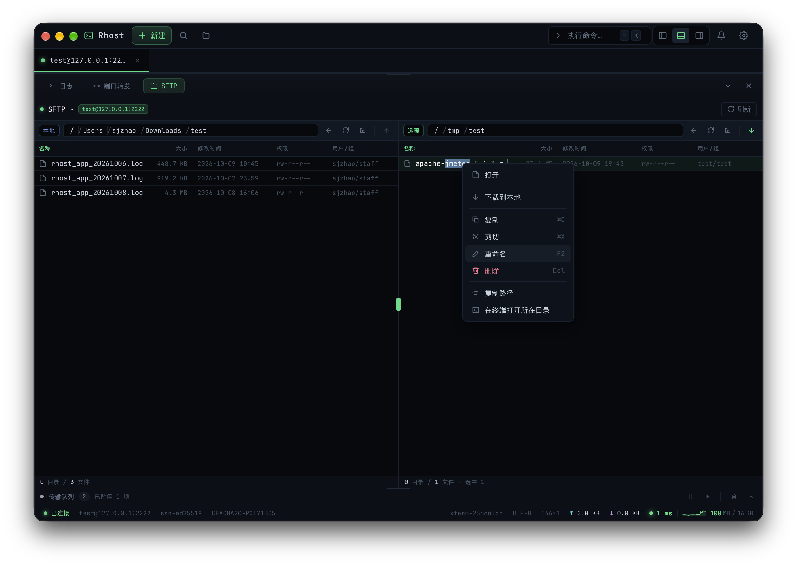
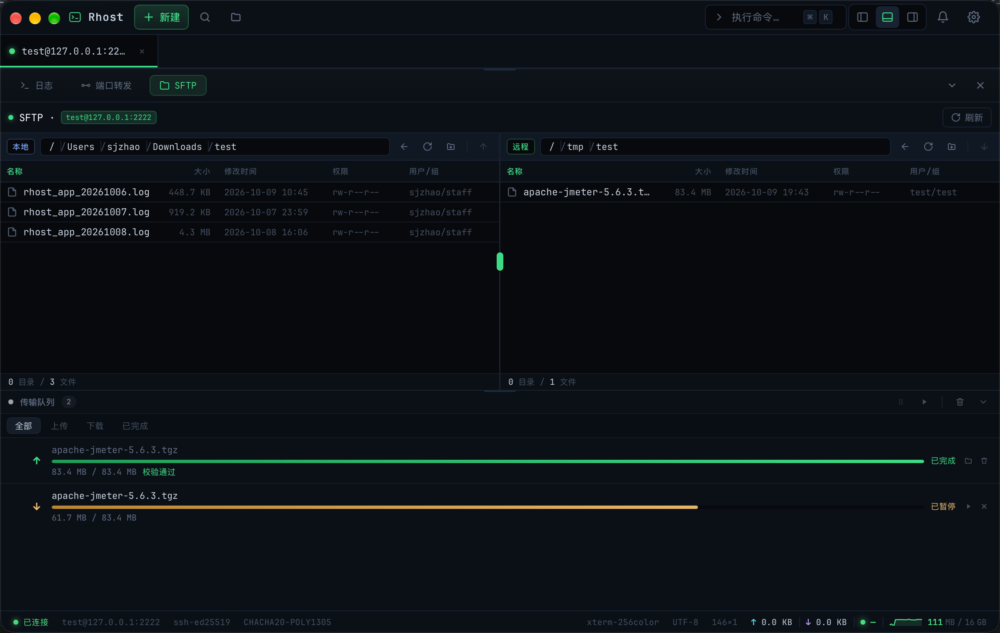

# SFTP 文件传输

> description: Rhost 内建 SFTP 文件管理器的双栏浏览、上传下载、断点续传与队列管理
>
> created: 2026-10-09 19:31:50
>
> updated: 2026-10-09 19:45:00
>
> author: [sjzhao](https://github.com/ShiJieCloud/rhost)

## 1. 入口

- 标签右键 → 「打开 SFTP 面板」
- 工作台底部 Dock → SFTP 标签

SFTP 会话复用当前 SSH 连接，无需额外认证。

## 2. 双栏文件浏览

SFTP 面板采用左右双栏布局：左侧为本地文件系统，右侧为远端文件系统。

### 2.1 文件信息

每条文件/目录展示以下信息：

| 字段 | 说明 |
|---|---|
| 名称 | 文件名，目录可双击进入 |
| 类型 | 目录 / 文件 / 符号链接 |
| 大小 | 文件字节数（目录显示 `—`） |
| 修改时间 | mtime |
| 权限 | 如 `rwxr-xr-x` |
| 所有者 | 如 `root/root` |

支持按名称、大小、修改时间排序，点击列头切换升降序。

### 2.2 目录导航

| 操作 | 方式 |
|---|---|
| 进入目录 | 双击目录 |
| 返回上级 | 路径栏的上级按钮，或 `..` 项 |
| 跳转路径 | 在路径栏输入绝对路径回车 |
| 刷新 | 工具栏刷新按钮 |

### 2.3 文件操作

本地与远端两侧支持相同的文件操作：

| 操作 | 说明 |
|---|---|
| 新建文件夹 | 工具栏「新建文件夹」，行内输入名称 |
| 新建文件 | 工具栏「新建文件」，行内输入名称 |
| 重命名 | 右键 → 重命名，行内编辑 |
| 删除 | 右键 → 删除，二次确认 |
| 复制 | 右键 → 复制（同侧复制） |
| 跨侧传输 | 拖拽或右键 → 上传/下载，进入传输队列 |

> 跨侧剪切粘贴：传输成功后自动删除源文件。

## 3. 传输队列

所有上传/下载任务进入传输队列，**串行执行**（同一时刻仅一个任务传输）。

### 3.1 任务状态

| 状态 | 颜色 | 说明 |
|---|---|---|
| pending | 灰 | 等待中 |
| running | 蓝 | 传输中 |
| paused | 橙 | 已暂停 |
| success | 绿 | 已完成 |
| error | 红 | 失败 |

### 3.2 队列操作

| 操作 | 作用 |
|---|---|
| 暂停 | 暂停运行中的任务（pending 任务不变） |
| 继续 | 恢复已暂停的任务 |
| 取消 | 取消 pending 或 running 的任务 |
| 重试 | 失败任务重新加入队列 |
| 清除已完成 | 移除所有 success 状态的任务 |

队列支持筛选：全部 / 上传 / 下载 / 已完成。

### 3.3 进度展示

每个任务展示：
- 进度百分比与进度条
- 实时传输速率（B/s，由后端进度事件提供）
- 已用时间

传输完成后自动刷新对侧目录，免去手动刷新。

## 4. 断点续传

设置项 `sftpResume` 开启后，传输中断后再次发起同名文件任务时，从已传输位置继续，无需从头重传。

- 关闭后，所有文件每次都完整从头传输
- 断点校验方式（`sftpResumeCheck`）用于续传前确认半截文件未被改动，可选文件大小 / 大小+mtime / SHA256 哈希

## 5. 传输设置

传输块大小、文件覆盖策略、断点续传等参数统一在「全局设置」中配置。详见 [全局设置](../reference/global-settings.md)。

## 6. 下一步

- [SSH 终端](./ssh-terminal.md)：终端使用指南；
- [全局设置](../reference/global-settings.md)：SFTP 传输参数配置；
- [主机与密钥管理](./host-management.md)：主机列表与连接配置。
