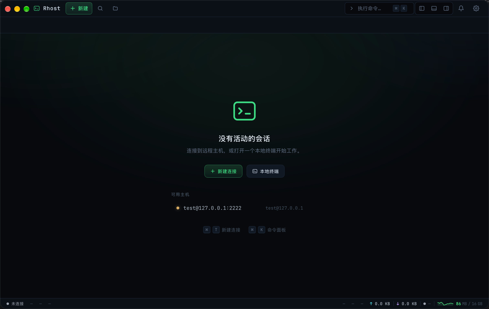
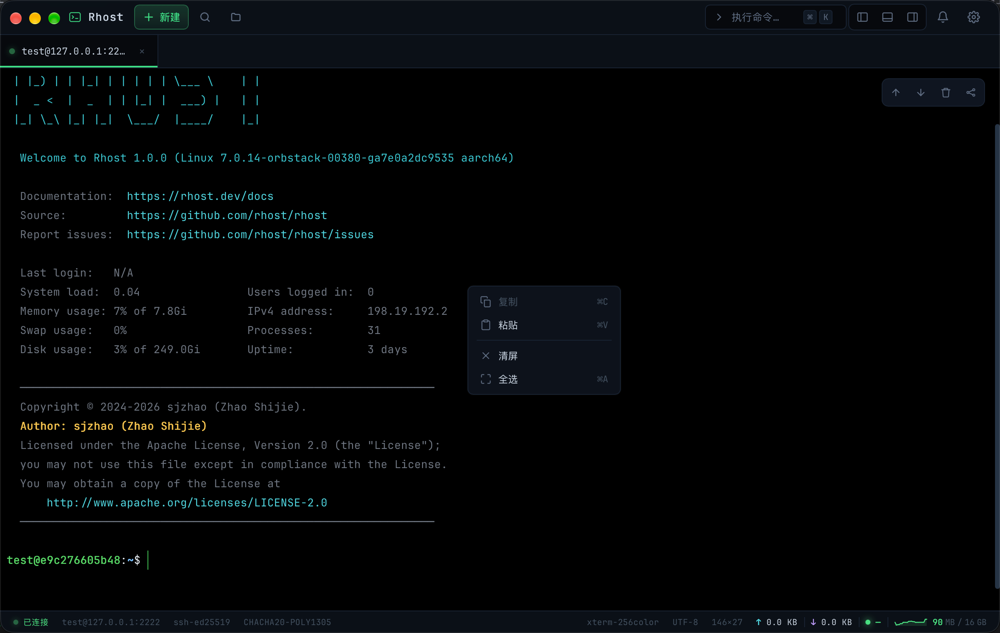
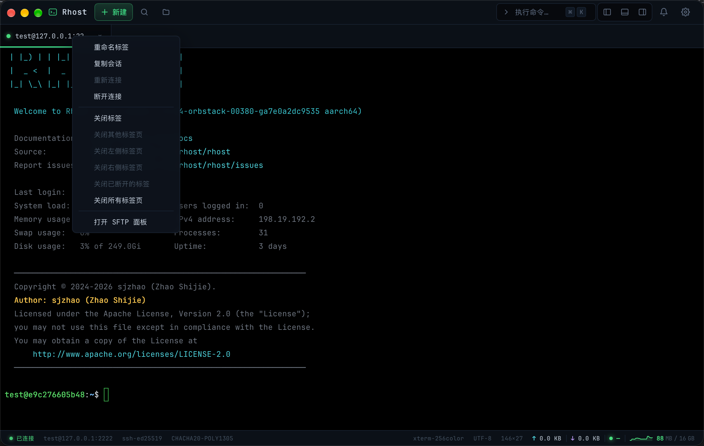
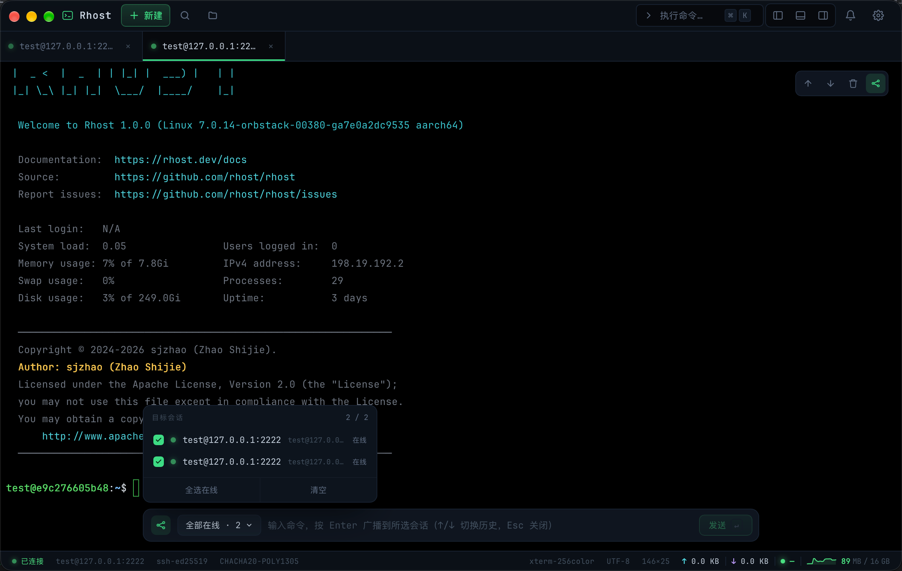
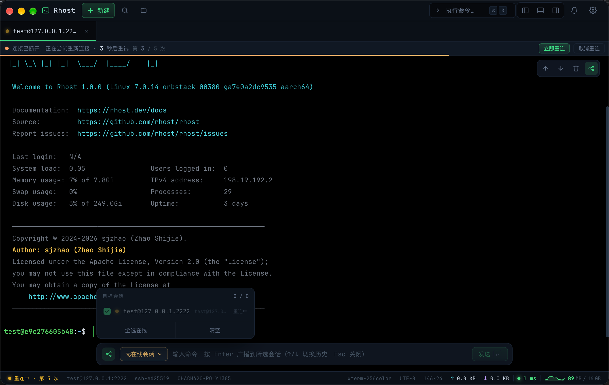

# SSH 终端使用指南

> description: Rhost 终端的输入输出、标签管理、广播、断线重连与外观设置
>
> created: 2026-10-09 19:14:43
>
> updated: 2026-10-09 19:40:00
>
> author: [sjzhao](https://github.com/ShiJieCloud/rhost)

## 1. 终端界面

工作台的终端区域由三部分组成：标签栏、终端画面、顶部工具条。

| 区域 | 说明 |
|---|---|
| 标签栏 | 顶部一行，每个打开的主机对应一个标签；右键标签弹出操作菜单 |
| 终端画面 | xterm.js 渲染的真终端，每个会话独立实例，切换标签不销毁实例 |
| 顶部工具条 | 悬浮在终端右上角，含滚动到顶/底、清屏、广播四个按钮 |

终端右上角工具条按钮：

| 按钮 | 功能 |
|---|---|
| ↑ | 滚动到顶部 |
| ↓ | 滚动到底部 |
| 垃圾桶 | 清屏（清空终端画面，不影响远端进程） |
| 广播图标 | 开启/关闭多会话广播命令 |

## 2. 基本操作

### 2.1 输入与输出

终端连接成功后直接键入命令，回车执行。终端使用 PTY 通道，支持完整的终端控制序列（颜色、光标移动、全屏程序如 `vim`/`htop`/`tmux`）。

### 2.2 复制与粘贴

| 操作 | 方式 |
|---|---|
| 复制 | 选中文字后自动复制到剪贴板（`trimOnCopy` 开启时自动修剪行尾空白） |
| 粘贴 | `⌘V` 或右键菜单「粘贴」 |

> **粘贴保护**：开启 `pasteGuard` 后，多行文本或含控制字符（`\x1b` 转义、`\x03` 中断等）的粘贴会弹出确认窗口，预览内容后再发送，防止剪贴板投毒。

### 2.3 右键菜单

终端区域右键弹出菜单：

| 菜单项 | 快捷键 | 说明 |
|---|---|---|
| 复制 | ⌘C | 复制选中文本（无选区时禁用） |
| 粘贴 | ⌘V | 从剪贴板粘贴 |
| 清屏 | — | 清空终端画面 |
| 全选 | ⌘A | 选中终端全部内容 |

### 2.4 清屏与滚动

- **清屏**：工具条垃圾桶按钮，或 `⌘L`
- **滚动**：鼠标滚轮、触摸板双指滑动，或工具条↑↓按钮跳转到顶/底

## 3. 标签页管理

### 3.1 新建与切换

- **新建标签**：`⌘T`，或标签栏空白处右键 → 「新建连接…」
- **切换标签**：点击标签
- **拖拽排序**：按住标签拖动可调整顺序

### 3.2 右键菜单

标签上右键弹出操作菜单：

| 操作 | 说明 |
|---|---|
| 重命名标签 | 行内编辑标签名称（Enter 保存，Esc 取消） |
| 复制会话 | 基于当前主机新建一个独立会话 |
| 重新连接 | 对断开的会话重新发起连接 |
| 断开连接 | 断开 SSH 会话但保留标签页与终端画面 |
| 关闭标签 | `⌘W`，关闭当前标签 |
| 关闭其他标签页 | 保留当前，关闭其余所有标签 |
| 关闭左侧/右侧标签页 | 关闭当前标签左/右的所有标签 |
| 关闭已断开的标签 | 批量关闭所有 offline 状态的标签 |
| 关闭所有标签页 | 关闭全部标签 |
| 打开 SFTP 面板 | 切换到该会话的 SFTP 文件管理 |

标签栏空白处右键可快速「新建连接…」「关闭已断开的标签」「关闭全部标签」。

## 4. 多会话广播

广播功能将同一条命令同时发送到多个在线会话，适合批量运维。

### 4.1 开启与关闭

- **开启**：工具条广播按钮，或 `⌘⇧B`
- **关闭**：按 `Esc`，或再次点击广播按钮

### 4.2 选择目标会话

开启广播后，终端底部出现广播条。点击「目标会话」可勾选要接收命令的会话，默认为全部在线会话。

### 4.3 发送命令

在广播输入框输入命令，回车发送到所有选中的会话。广播命令独立于正常终端输入，不会影响单个会话的光标位置。

## 5. 连接生命周期

### 5.1 会话状态

每个标签页有独立的连接状态：

| 状态 | 说明 |
|---|---|
| `idle` | 未连接 |
| `connecting` | 正在建立连接 |
| `online` | 已连接 |
| `reconnecting` | 断线后正在重连 |
| `offline` | 连接已断开（手动断开或重连失败） |

连接中、断线、重连时，终端顶部显示状态条，提示当前阶段与剩余倒计时。

### 5.2 断开与重连

| 操作 | 方式 |
|---|---|
| 断开连接 | 标签右键 → 「断开连接」（保留标签页） |
| 重新连接 | 标签右键 → 「重新连接」，或状态条「重新连接」按钮 |
| 立即重连 | 自动重连等待中，状态条「立即重连」跳过倒计时 |
| 取消重连 | 状态条「取消重连」停止自动重连 |

> 断开连接 ≠ 关闭标签：断开后标签页与终端画面保留，可重新连接恢复会话；关闭标签则彻底销毁会话。

### 5.3 自动重连

设置项 `autoReconnect` 开启后，网络异常断开会自动重连（远端主动 `exit`、手动断开不触发）。

- 退避策略：从 1 秒起指数增长，封顶 30 秒
- 最大次数：`autoReconnectMaxAttempts`，`0` 表示不限
- 重连成功后状态条显示「连接已恢复」

## 6. 底部状态栏

工作台底部状态栏实时显示当前会话的连接状态、SSH 协商算法、网络速率、延迟与应用内存占用。

### 6.1 状态栏信息项

| 区域 | 内容 | 说明 |
|---|---|---|
| 连接状态 | 脉冲点 + 文字 | 未连接 / 已连接 / 连接中 / 重连中（第 N 次） / 已断开 |
| 连接信息 | `user@host:port` | 当前会话的主机地址 |
| 主机密钥 | 算法名 | SSH 握手协商的主机密钥算法 |
| 加密算法 | 算法名 | 如 `AES-256-GCM`（自动去 `@openssh.com` 后缀并美化） |
| 终端类型 | TERM | 远端终端类型 |
| 编码 | enc | 字符编码 |
| 终端尺寸 | `列×行` | xterm fit 后的实时行列数 |
| 上传速率 | ↑ KB/s 或 MB/s | 本地上行网络速率（离线为 0） |
| 下载速率 | ↓ KB/s 或 MB/s | 本地下行网络速率（离线为 0） |
| 延迟 | RTT ms | 网络往返时间，分档着色 |
| 应用内存 | 迷你折线图 + 用量/总量 | Rhost 主进程 RSS 内存占用与趋势 |

### 6.2 状态颜色分档

**延迟**（RTT）：

| 范围 | 颜色 | 含义 |
|---|---|---|
| < 80 ms | 绿 | 优 |
| < 200 ms | 黄 | 良 |
| ≥ 200 ms | 红 | 差 |
| 离线 | — | 不显示 |

**应用内存**：

| 条件 | 颜色 | 含义 |
|---|---|---|
| 用量 < 告警阈值 且 占比 < 20% | 绿 | 正常 |
| 用量 ≥ 告警阈值 或 占比 ≥ 20% | 黄 | 警告 |
| 用量 ≥ 1 GB 或 占比 ≥ 40% | 红 | 危险 |

> 内存告警阈值可在「全局设置」中配置（`memAlertMb`），采集间隔由 `memInterval` 控制。工作台不可见（回首页、窗口最小化）时自动暂停内存采集，恢复可见后立即补帧。

## 7. 终端外观与行为

终端的字体、字号、光标样式、回滚缓冲、粘贴保护、右键行为、彩色提示符、MOTD、自动重连等参数，统一在「全局设置」中配置。详见 [全局设置](../reference/global-settings.md)。

## 8. 下一步

- [主机与密钥管理](./host-management.md)：主机列表、分组、连接表单与密钥管理；
- [快速连接](./quick-connect.md)：命令式一键连接；
- [SSH 端口转发](../explanation/design/tunnel-design.md)：端口转发规则设计；
- [标签右键菜单设计](../explanation/design/tab-context-menu-design.md)：标签页操作菜单的设计与实现。
