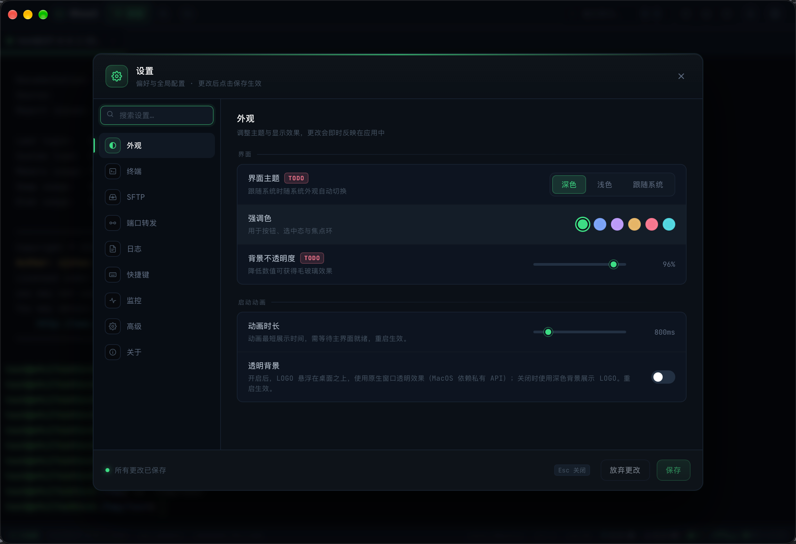
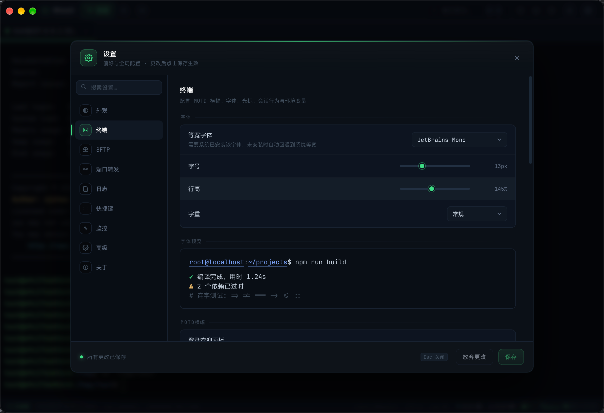
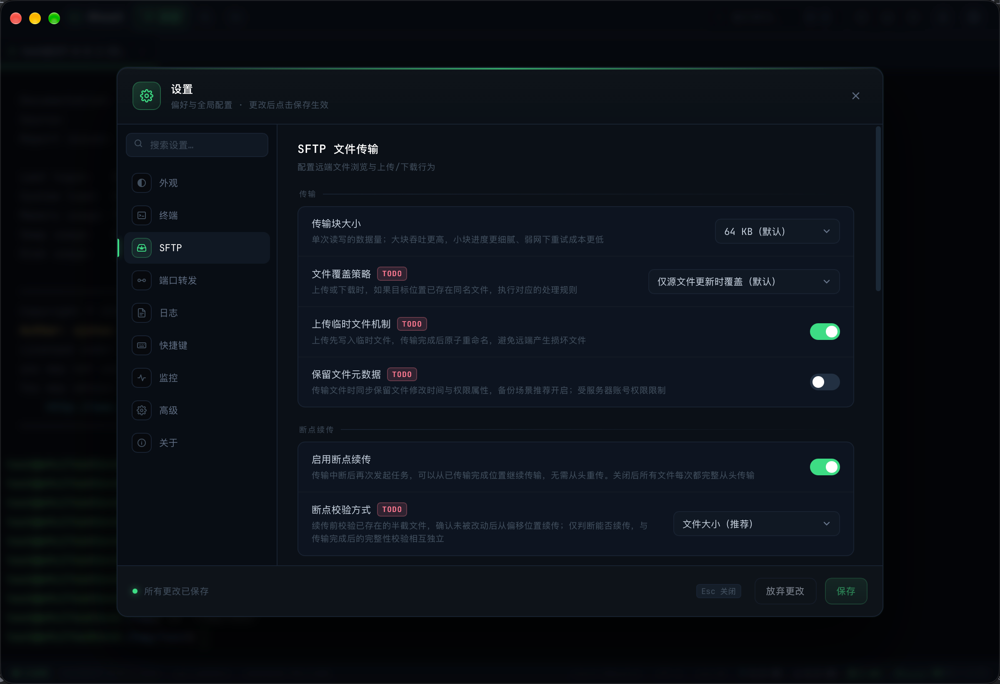
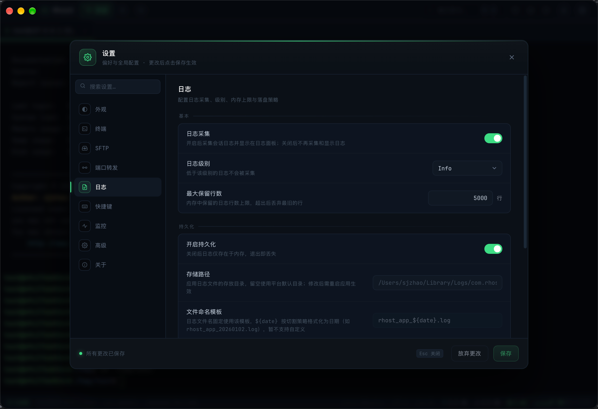
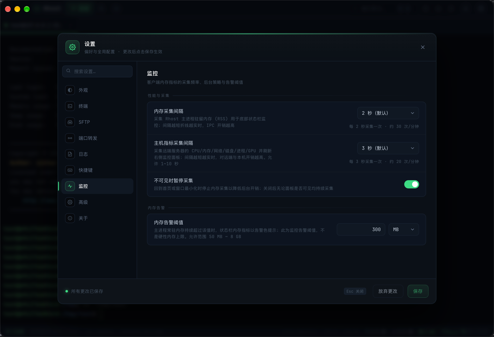

# 全局设置

> description: Rhost 外观、终端、SFTP、端口转发、日志、快捷键与监控等设置项说明
>
> created: 2026-10-09 19:31:50
>
> updated: 2026-10-09 20:02:00
>
> author: [sjzhao](https://github.com/ShiJieCloud/rhost)

## 1. 入口

- 快捷键：`⌘,`
- 菜单：应用菜单 → 设置

设置项持久化到 `app_config.json` 的 `settings` 节（日志相关字段归入 `logs` 节），修改后即时写入。

## 2. 外观

### 2.1 界面

| 设置项 | 取值 | 默认值 | 说明 | 状态 |
|---|---|---|---|---|
| 界面主题 | 跟随系统 / 深色 / 浅色 | 深色 | 跟随系统时随系统外观自动切换 | ⚠️ 未开发 |
| 强调色 | 颜色值 | `#3ddc84` | 用于按钮、选中态与焦点环 | ✅ |
| 背景不透明度 | 60~100（%） | 96 | 降低数值可获得毛玻璃效果 | ⚠️ 未开发 |

### 2.2 启动动画

| 设置项 | 取值 | 默认值 | 说明 |
|---|---|---|---|
| 动画时长 | 200~5000（ms） | 400 | 动画最短展示时间，需等待主界面就绪，重启生效 |
| 透明背景 | 开 / 关 | 开 | 开启后 LOGO 悬浮在桌面之上（macOS 依赖私有 API）；关闭时使用深色背景。重启生效 |

## 3. 终端

### 3.1 字体

| 设置项 | 取值 | 默认值 | 说明 |
|---|---|---|---|
| 等宽字体 | 系统已安装字体 | JetBrains Mono | 未安装时自动回退到系统等宽 |
| 字号 | 10~20（px） | 13 | 终端字体大小 |
| 行高 | 100~200（%） | 145 | 行高倍数 |
| 字重 | 300 / 400 / 500 / 700 | 400 | 字体粗细 |

### 3.2 MOTD 横幅

| 设置项 | 取值 | 默认值 | 说明 |
|---|---|---|---|
| 登录欢迎面板 | 开 / 关 | 开 | 连接成功后采集服务器负载、内存、磁盘、IP 等状态绘制 MOTD 横幅；开启时自动屏蔽 sshd 原生 MOTD 与 Last login |
| 自定义 LOGO | ASCII 文本 | 空 | 开启开关后用文本域中的 ASCII art 替换内置 LOGO；最多 30 行、每行 200 字符 |

### 3.3 行为

| 设置项 | 取值 | 默认值 | 说明 |
|---|---|---|---|
| 彩色提示符 | 开 / 关 | 开 | 为无颜色的远端 shell 配置彩色 PS1；远端已有彩色配置时自动跳过 |
| 回滚缓冲区 | 1000~100000（行） | 10000 | 可向上滚动的历史行数 |
| 复制时去除行尾空格 | 开 / 关 | 开 | 复制选中文本时修剪行尾空白 |
| 粘贴保护 | 开 / 关 | 关 | 多行粘贴或含控制字符时弹窗确认 |
| 断线自动重连 | 开 / 关 | 开 | 网络异常断开时自动重连（1s 起指数退避，封顶 30s）；远端主动 exit、手动断开不触发 |
| 自动重连次数上限 | 0~20（次） | 5 | 达到上限后停止并保留标签等待手动重连；0 表示不限 |
| 右键行为 | 菜单 / 粘贴 | 菜单 | 终端内右键弹出菜单或直接粘贴 |

### 3.4 光标

| 设置项 | 取值 | 默认值 | 说明 |
|---|---|---|---|
| 光标样式 | block / bar / underline | bar | 方块 / 竖线 / 下划线 |
| 光标闪烁 | 开 / 关 | 开 | 空闲 1 秒后开始闪烁 |

### 3.5 环境变量

可配置 SSH 会话建立时注入的环境变量，默认注入 `EDITOR=nvim` 与 `LANG=zh_CN.UTF-8`。

## 4. SFTP 文件传输

### 4.1 传输

| 设置项 | 取值 | 默认值 | 状态 |
|---|---|---|---|
| 传输块大小 | 32 / 64 / 128 / 256 / 512 / 1024 KB | 64 KB | ✅ |
| 文件覆盖策略 | 仅源更新时覆盖 / 跳过 / 直接覆盖 / 每次询问 | 仅源更新时覆盖 | ⚠️ 未开发 |
| 上传临时文件机制 | 开 / 关 | 关 | ⚠️ 未开发 |
| 保留文件元数据 | 开 / 关 | 关 | ⚠️ 未开发 |

### 4.2 断点续传

| 设置项 | 取值 | 默认值 | 状态 |
|---|---|---|---|
| 启用断点续传 | 开 / 关 | 开 | ✅ |
| 断点校验方式 | 文件大小 / 大小+mtime / SHA256 | 文件大小 | ⚠️ 未开发 |

### 4.3 并发与限速

| 设置项 | 取值 | 默认值 | 状态 |
|---|---|---|---|
| 全局最大并发传输任务 | 1~20 | 3 | ⚠️ 未开发 |
| 单主机最大并发传输任务 | 1~10 | 1 | ⚠️ 未开发 |
| 全局带宽限速 | KB/s，0 不限 | 0 | ⚠️ 未开发 |
| 单任务带宽限速 | KB/s，0 不限 | 0 | ⚠️ 未开发 |
| 失败重试次数 | 0~20 | 3 | ⚠️ 未开发 |
| 重试间隔 | ms | 1000 | ⚠️ 未开发 |

### 4.4 安全与完整性

| 设置项 | 取值 | 默认值 | 状态 |
|---|---|---|---|
| SFTP 会话空闲超时 | 秒，0 不关闭 | 300 | ⚠️ 未开发 |
| 传输完成后 Hash 校验 | 开 / 关 | 关 | ⚠️ 未开发 |
| 文件黑名单 glob | 一行一条 | `.DS_Store` `Thumbs.db` | ⚠️ 未开发 |

### 4.5 浏览

| 设置项 | 取值 | 默认值 | 状态 |
|---|---|---|---|
| 显示隐藏文件 | 开 / 关 | 关 | ✅ |

## 5. 端口转发

### 5.1 规则

| 设置项 | 取值 | 默认值 | 说明 | 状态 |
|---|---|---|---|---|
| 连接后自动启用规则 | 开 / 关 | 关 | SSH 连接建立后自动启动已保存的转发规则 | ✅ |
| 本地端口占用处理 | 终止 / 跳过 / 顺延端口 | 终止 | 监听端口被占用时的处理方式 | ✅ |
| 建立失败重试次数 | 0~20 | 3 | 转发通道建立失败时的自动重试次数 | ✅ |

### 5.2 选项

| 设置项 | 取值 | 默认值 | 说明 | 状态 |
|---|---|---|---|---|
| 通道断开自动重建 | 开 / 关 | 开 | 断线重连成功后按断开前状态恢复转发规则 | ✅ |
| 通道保活间隔 | 秒 | 15 | 主连接 RTT 心跳已覆盖该作用 | ⚠️ 未开发 |
| 空闲自动断开 | 秒，0 不断开 | 0 | 通道持续无流量超过时长后自动关闭 | ⚠️ 未开发 |
| SOCKS 域名解析位置 | 本地 / 远端 | 本地 | 动态转发中域名在哪一侧解析 | ✅ |

## 6. 日志

### 6.1 基本

| 设置项 | 取值 | 默认值 | 说明 |
|---|---|---|---|
| 日志采集 | 开 / 关 | 开 | 关闭后不再采集和显示日志 |
| 日志级别 | debug / info / warn / error | info | 低于该级别的日志不会被采集 |
| 最大保留行数 | 正整数 | 5000 | 内存中保留的日志行数上限，超出丢弃最旧 |

### 6.2 持久化

| 设置项 | 取值 | 默认值 | 说明 |
|---|---|---|---|
| 开启持久化 | 开 / 关 | 开 | 关闭后日志仅存内存，退出即丢失 |
| 存储路径 | 目录路径 | 空（平台默认） | 留空使用平台默认目录；修改后需重启 |
| 文件命名模板 | 文本 | `rhost_app_${date}.log` | `${date}` 按切割策略格式化为日期 |
| 切割策略 | 按天 / 按周 / 按月 / 不切割 | 按天 | 按时间切割日志文件 |
| 最大文件数量 | 0 不限 | 100 | 超出后删除最旧文件 |
| 保留天数 | 正整数 | 30 | 超过后按时间清理旧文件 |

## 7. 快捷键

点击任意组合即可重新录制，按 Esc 取消。

### 7.1 会话

| 设置项 | 默认值 | 状态 |
|---|---|---|
| 新建标签页 | ⌘+T | ⚠️ 未开发 |
| 关闭标签页 | ⌘+W | ⚠️ 未开发 |
| 垂直分屏 | ⌘+D | ⚠️ 未开发 |
| 水平分屏 | ⌘+E | ⚠️ 未开发 |

### 7.2 操作

| 设置项 | 默认值 | 状态 |
|---|---|---|
| 清空屏幕 | ⌘+L | ⚠️ 未开发 |
| 命令面板 | ⌘+K | ⚠️ 未开发 |
| 查找 | ⌘+F | ⚠️ 未开发 |
| 打开设置 | ⌘+, | ⚠️ 未开发 |

> 快捷键录制入口已提供，但当前均未绑定实际键盘事件。

## 8. 监控

### 8.1 性能与采集

| 设置项 | 取值 | 默认值 | 说明 | 状态 |
|---|---|---|---|---|
| 内存采集间隔 | 秒 | 2 | 采集 Rhost 主进程 RSS 用于底部状态栏 | ✅ |
| 主机指标采集间隔 | 1~10 秒 | 3 | 采集远端 CPU/内存/网络/磁盘/进程/GPU | ✅ |
| 不可见时暂停采集 | 开 / 关 | 开 | 回首页或窗口最小化时停止内存采集 | ✅ |

### 8.2 内存告警

| 设置项 | 取值 | 默认值 | 说明 | 状态 |
|---|---|---|---|---|
| 内存告警阈值 | MB | 300 | 主进程 RSS 持续超过该值时状态栏告警 | ✅ |

## 9. 关于

| 设置项 | 取值 | 默认值 | 说明 |
|---|---|---|---|
| 自动更新 | 开 / 关 | 开 | 检测到新版本时自动更新 |
| 更新通道 | stable / beta / dev | stable | 选择更新接收的通道 |

## 10. 下一步

- [SSH 终端](../guides/ssh-terminal.md)：终端使用指南；
- [SFTP 文件传输](../guides/sftp.md)：SFTP 上传下载与队列管理；
- [主机与密钥管理](../guides/host-management.md)：主机列表与连接配置。
